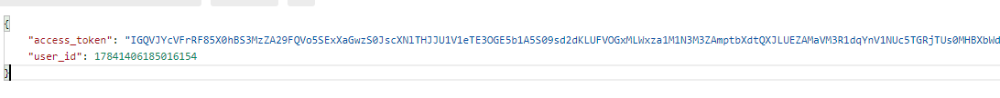
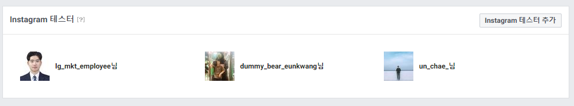

# instagram-get-accessToken

##### 개요
- 여러 사용자들의 미디어 데이터를 가져오기 위해선 사용자들의 엑세스 토큰 값을 받아야한다.
- 그러기 위해서 Oauth 인증 방식을 통하여 사용자의 엑세스 토큰 값을 받아온다.

##### 사용 방법
1. redirect 요청을 받을 서버를 구축하고 https 인증서를 발급받아 적용시킨다.
2. facebook 개발자에 접속하여 Instagram basic display의 기본 표시에 접근.
3. 유효한 OAuth 리디렉션 URI에 생성한 서버 주소를 입력하고 저장.
4. index.html의 script내부에 redirect_uri와 client_id(기본 표시에 Instagram 앱 ID)를 입력해준다.
5. index.html를 실행하고 버튼을 클릭하면 redirect_uri로 code값이 param값으로 받아진다.
6. 해당 code값을 활용하여 엑세스 토큰값 받아올 수 있다.

##### code값으로 엑세스 토큰 값 받기
- https://api.instagram.com/oauth/access_token주소에 post방식으로 data를 추가해서 전송
- 추가할 데이터 
  - client_id // 개발자 계정의 client_id
  - client_secret // 개발자 계정의 client_secret
  - grant_type // authorization_code 
  - redirect_uri // 토큰값 반환되는 주소 
  - code // 5에서 넘겨 받은 사용자의 code

##### 문제점
- 개발 모드에서는 역활에서 다른 계정을 테스터로 추가하시거나, 테스트 계정을 생성한 사용자만 테스트 가능하며, 이후 개발모드 해제를 위해서는 앱 검수가 진행된 이후 정상적으로 일반사용자도 로그인을 이용할수 있습니다.

##### Todolist
- 비지니스 계정 생성
- 검수 완료